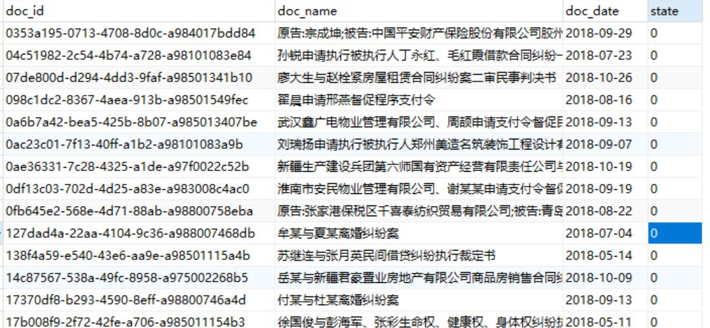

# caipanwenshu
2018.10.9 针对请求参数vl5x的加密和详情页DocID解密。
绝大部分以python代码实现。后续如有改动，将持续更新。

## 分析步骤
https://www.jianshu.com/p/bac8b9be98e8

## 爬虫实现
* 使用scrapy框架，目前可正常解析docid
* 在请求案件文档详细信息接口时频繁会出发验证码机制，需要自行测试请求频率临界点或者上代理IP。
* 由于网站限制每个查询条件最多获取200条数据，代码已经实现尽可能详尽的查询，但不保证数据完整性。
* 案件文档基本信息

* 案件文档详细信息
